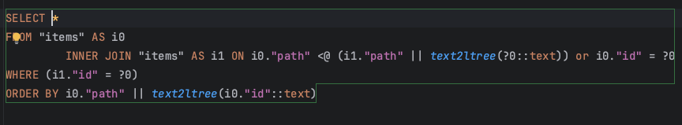

- Questions/Challenges
  - How to store/structure notes?
    collapsed:: true
    - Store ancestry path
      - 
      - Ids have to be appended to the path during query
      - Makes moving items in the tree somewhat because all items below have to updated as well
    - Adjacency list (parent_id)
      - Unpredictable query performance
      - Getting the path to a given item requires a query
  - Rendering:
    collapsed:: true
    - Items can be rendered as a flat list, allowing us to take advantage of [Phoenix.LiveView.stream](https://hexdocs.pm/phoenix_live_view/Phoenix.LiveView.html#stream/4)
      - Indentation can be done using CSS
  - How to handle drag and drop?
    - Needs JavaScript, maybe [SortableJS](https://github.com/SortableJS/Sortable)
  - How to do live editing?
    - Check out [Delta](https://github.com/slab/delta-elixir) which implements a data structure used for Operational Transform
      - https://slab.com/blog/announcing-delta-for-elixir/
      - https://en.wikipedia.org/wiki/Operational_transformation
  - Link unfurling
    - Eric already wrote the [web_inspector](https://github.com/eteubert/web_inspector) for link unfurling that can be used and expanded
    - How and when are the links processed?
